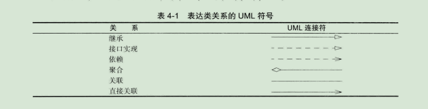
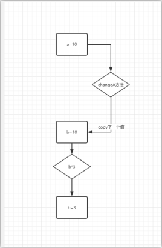
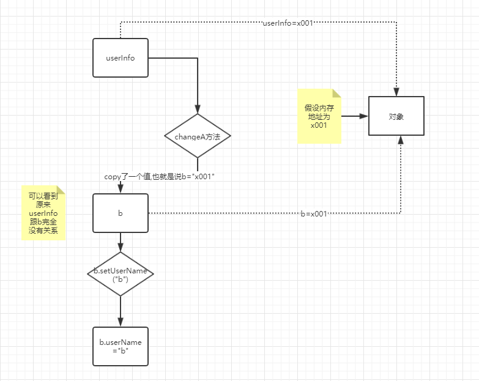
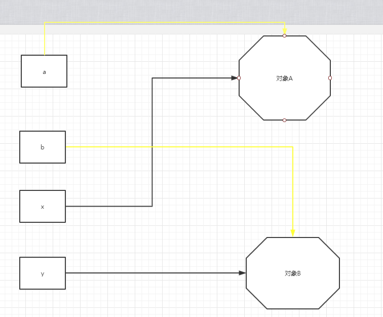
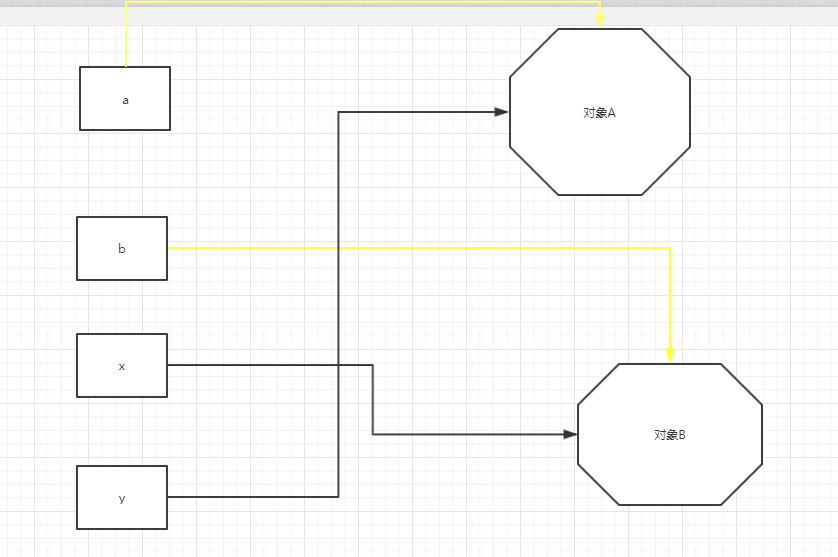

### 1.类与对象

#### 	1.类

​		类（class）是构造对象的模板或蓝图。我们可以将类想象乘制作小甜饼的切割机，将对象想象为小甜饼。由类构造（construct）对象的过程称为创建类的实例（instance）

​		**封装**（encapsulation,有时称为数据隐藏）是与对象有关的一个重要概念。从形式上看，封装不过是将数据和行为组合在一个包中，并对对象的使用者隐藏了数据的实现方式。对象中的数据称为实例域（instance field）,操作数据的过程称为方法（method）.对于每个特定实例（对象）都有一句特定的实例域值。这些值的结合就是这个对象的当前状态（state）。无论何时，只要向对象发送一个消息，它的状态就有可能发生改变

​		实现封装的关键在于绝对不能让类中的方法直接的访问其他类的实例域。程序仅通过对象的方法与对象的数据进行交互

​		**拓展类**，o可以通过拓展一个类来建立另外一个新的类。

#### 	2.对象

​		要想使用OOP，一定要清楚对象的三个主要特性

- 对象的行为（behavior）--------可以对对象施加那些操作，或可以对对象施加那些方法

- 对象的状态（state）-------------当施加那些方法时，对象如何响应

- 对象标识（identity）--------------如何辨别具有相同行为与状态的不同对象

  同一个类的所有对象实例，因为支持相同的行为而具有家族的相似性。对象的行为是用可调用的**方法**定义的。

  每个对象都保存着描述当前特征的信息。这就是对象的状态。对象的状态可能会随着时间而发生改变。但这种改变不会是自发的。对象的状态的改变必须通过调用方法实现（如果不经过方法调用就可以改变对象状态。只能说明封装性遭到了破坏）。

​      但是对象的状态并不能完全描述一个对象。每个对象都有一个唯一的身份（identity）。例如在一个订单处理系统中。任何两个订单都存在着不同之处。即使所订购的货物完全相同也是如此。需要注意，作为一个类的实例，每个对象的标识永远是不同的，状态常常也存在着差异

​		对象的这些关键特性在彼此之间相互影响着。例如，对象的状态影响它的行为（如果一个订单已发货或已付款，就应该拒绝调用具有增删订单中条目的方法。反过来，如果订单时空的，即还没有加入预定的物品，这个订单就不应该进入“已送货”状态）

#### 3.识别类

​	识别类的简单规则则是在分析问题的过程中寻找名词，而方法对应动词。

例如，在订单处理系统中，有这样一些名词：

- 商品（Item）
- 订单（Order）
- 送货地址（Shipping address）
- 付款（Payment）
- 账户（Account）

这些名词很可能称为类Item,Order等

​	识别方法：查看动词：商品被添加到订单中，订单被发送或取消，订单贷款被支付。对于每一个动词如：添加，发送，取消，支付，都要标识出主要负责完成相应动作的对象。例如，当一个新的商品添加到订单中时，那个订单对象就是被指定的对象，因为他指定任何存储商品以及如何对商品进行排序。也就是说add应该时Order类的一个方法。而Item对象是一个参数

#### 4.类之间的关系

在类之间，最常见的关系

- 依赖（“users-a”）
- 聚合（“has-a”）
- 继承（“is-a”）

​    依赖（dependence），即“users-a”关系，时一种最明显的最常见的关系。例如，Order类使用Account类时因为Order对象需要访问Account对象查看信用状态。但是Item类不依赖于Acccount类，这是因为Item对象与客户账户无关。因此，如果一个类的方法**操作**另一个类的对象，我们就说这个类**依赖**于另一个类

​	注意：应该尽可能将相互依赖的类减至最少，如果类A不知道B的存在。他就不会关心b的任何改变（着意味着B的改变不会导致A产生任何bug）.用软件工程的术语来说就是让类之间的耦合度最小

​	聚合（aggregation），即“has-a”关系，时一种具体且易于理解的关系。例如，一个Order对象包含一些Item对象。聚合关系意味着类A的对象包含类B的对象。

​	继承（inheritance）,即“is-a”关系。是一种用于特殊与一般关系的。如果类A拓展类B，类A不但包含从类B继承的方法，还会拥有一些额外的功能



#### 5.对象与对象变量

​	要想使用对象，就必须构造对象，并指定其初始状态。任何对对象应用方法。

​	在java中是使用构造器（constructor）构造新实例。构造器是一种特殊的方法，用来构造并初始化对象。

​	在对象与对象变量之间存在着一个重要的区别。例如

```java
Date deadLine
```

​	定义了一个对象变量deadLine.他可以引用Date类型的对象。但是，一定要认识到：变量deadLine不是一个对象，实际上也没有引用对象。此时不能将任何Date方法应用于这个变量上

```java
s=deadLine.toString();
```

​	会发生编译错误

​	必须首先初始化变量deadLine。

```java
deadLine=new Date();
//或者指向一个已存在的对象
deadLine=a;//注意a跟deadLine都是指向同一个对象
```

​	总结：

​		一个对象变量并没有实际包含一个对象，仅仅引用一个对象；在java中，任何对象变量的值都是对存储在另一个地方的一个对象的引用。new操作符返回值也是一个引用

```java
Date deadLine=new Date();
```

​		可以看作是两部分。表达式new Date()构造了一个Date类型的对象。并且他的值是对新创建对象的引用。这个引用存储在变量deadLine中；

​		我们可以显示的将对象变量设置为null,表明这个对象变量目前没有引用任何对象

```java
Date deadLine=new Date();
deadLine=null;
//注意局部变量不会自动的初始化为null,而必循通过调用new或将它们设置为null进行初始化
```

#### 6.用户自定义类

```java
public user(String name,int age){
	name=name;
    age=age
}//构造器与类同名。在构造user对象时，构造器会运行，以便将实例域初始化所希望的状态
new User("gbb",26);//会将实例域设置为 name=gbb age=26
```

​		构造器与其他的方法有一个重要的不同。构造器总是伴随着new操作符的执行被调用；构造器没有返回值；

​	1.显示参数与隐式参数

```java
public void getZhouSui(int ageSimple){
     age=age+ageSimple;   
}//ageSimple被称为显示参数，age为隐式参数。类似于
public void getZhouSui(int ageSimple){
     this.age=this.age+ageSimple;   
}//在每一个方法中，关键字this表示隐式参数，加上this可以将实例域跟局部变量分开
```

#### 7.封装的有点

​	getName(),getAge()方法是典型的访问器方法。因为它们只返回实例域值，因此也被称为域访问器；如果将name,age标记为public可以吗？

​	关键在于name是一个只读域（如果没有set方法），一旦在构造器中设置完毕，就没有任何一个办法可以对他进行修改，这样来确保name域不会被外界所破坏。

​	如果要想进行修改，那么设置一个set方法，如果发现错误，也就只要调试这一个接口就行。所以正常情况下需要下面3个接口

- 一个私有的数据域（属性,比如name）
- 一个公有的域访问器方法（get方法，比如getName()）
- 一个共有的域更改器方法（set方法，比如setName()）

首先，虽然不是公有的数据域，但是可以通过get，set方法实现修改私有域的方法，这样做可以不修改其他代码，比如当返回name的时候，还想返回他的年龄就可以这么做

```java
public getName(){
	return name+",年龄为age"
}
```

注意：

​	在类中返回类，比如

```java
pulic class User{
	private Student student;
    
    public void getStudent(){
        return student;
    }
}
```

这样是违背了封装性，因为

```java
User user=new User(studentA);//假设studentA中的name为a
Student b=user.getStudent();
b.setName("b");
//那么user获取student的name的时候也会是b
user.getStudent().getName//会是b,因为对于引用类型，直接赋值，是将对象的物理地址赋值给对方
```

#### 8.基于类的访问权限

​	方法可以调用所属类id所有私有特性

1.私有方法

​	在实现一个类时，由于公有数据非常危险，所以应该将所有的数据域都设置为私有的。而方法，在有的时候也可以设置为私有域。比如在一个类中，有些方法就只能当前类使用，比如计算价格，那么久可以将public改为private,这样做的号出就是，如果想要修改这个方法，那么就可以直接修改，或者删除。而如果是公有的就要考虑有没有其他方法需要它

2.final实例域

​	如果希望有一个参数在构建对象时就去欸的那个，并且在后面的操作中，不能够对他进行修改。那么可以设置为final

```java
private final String name;//那么对每一个对象来说他都是固定的
```

#### 9.静态域与静态方法

1.静态域

​	如果将域定义为static，每一个类中只有这样的域。而每一个对象对于所有的实例域却都有自己的一份拷贝。比如

```java
//给user一个实例域id和一个静态类extendsId
class user{
    private static String extendsId;
	private String id;
}
```

​		现在每一个user对象都有自己的一个id域，但是这个类（user）的所有实例共享一个extendsId.换句话说，如果有1000个user，那么就有1000个实例域id.但是，只有一个静态域extendsId。即使没有user对象。静态域extendsId也存在。他属于类，而不属于任何独立的对象

​		总结：

​			static修饰的变量叫做静态变量，是属于类的；但是静态变量很少使用。

2.静态常量

```java
public class Math
{
	.....
	public static final double PI=3.1415926;
	......
}

```

​	在程序中，可以采用Math.PI的形式获得这个常量

​	如果关键字static被省略，PI就变成了Math类的一个实例域。需要通过Math类的对象访问PI，并且每一个Math对象都有他自己的一份PI拷贝

​	前面提过，由于每个类对象都可以对公有域进行修改，所以最好不要将域设计为public.然而公有常量（即final域）却没有问题

3.静态方法

​	静态方法是已种不能向对象实施操作的方法。例如，Math类的pow就是一个静态方法。表达式

​	Math.pow(x,a)

​	计算x的a次方，在运算时，不适用任何Math对象。换句话说，没有隐式的参数（没有隐式参数也就是说没有this）

​	User类的静态方法不能访问Id实例域，因为他不饿能操作对象，但是静态方法可以访问自身类中的静态域

```java
public static String getExtendsId(){
    return extendsId;
}
```

注意：

​	虽然静态方法不能调用实例域，但是对象可以调用静态方法；在两种情况下使用静态方法

- 一个方法不需要访问对象状态(类的属性)，其所需参数都是通过显示参数提供（就是方法中不会出现去对象里面取属性）
- 一个方法只需要访问类的静态域（例如，User.getExtendsId）

4.工厂方法

​		静态方法另一个常见的用途就是工厂方法，比如NumberFormat来构造对象

```java
public static void main(String[] args) {
    NumberFormat numberFormat= NumberFormat.getCurrencyInstance();
    NumberFormat percentFormat = NumberFormat.getPercentInstance();
    double x = 0.1;
    System.out.println(numberFormat.format(x));//￥0.10
    System.out.println(percentFormat.format(x));//10%
}
```

为什么NumberFormat类不利用构造器完成这些操作呢

- 无法命名构造器。构造器的名字必循跟类名相同。但是这里将得到的货币实例和百分比实例采用的时不同的名字
- 当使用构造器时，无法改变所构造的对象类型。而Factory方法将返回一个DecimalFormat类对象。这是NumberFormat的子类

#### 10 方法参数

​		java程序设计语言总是按值调用。也就是说，方法得到的是所有参数值的一个copy。方法不能修改传递给他的任何参数变量的内容

```java
public static void main(String[] args) {
    double a = 10;
    changeA(a);
    System.out.println(a);
}

private static void changeA(double b) {
    b =b* 3;
}
//a =10
```

1. b被初始化为a值的一个copy(也就是10)

2. b被乘以3后等于30.但是a依然是10

3. 这个changeA方法结束之后，参数b就不再使用

   

   

然而方法参数公有两种类型

- 基本数据类型
- 对象引用

一个方法不可能修改一个基本数据类型的参数。而对象引用作为参数就不同了，可以进行修改

```java
public static void main(String[] args) {
    UserInfo userInfo = new UserInfo();
    userInfo.setUserName("a");
    changeA(userInfo);
    System.out.println(userInfo.getUserName());
}

private static void changeA(UserInfo b) {
    b.setUserName("b");
}
//输出结果：b
```

1.b被初始化为userInfo值的一个拷贝，这里是一个对象的引用

2.changeA方法应用于这个对象引用，所以userInfo,b两个对象都会是b（因为他们的值都是同一个对象的地址）

3.方法结束后，参数变量b就不再使用。



​		可以看到引用类型对象的参数状态改变不是一件难事，理由很简单，方法得到的是对象引用的拷贝，对象引用及其他的拷贝同时引用同一个对象。

​		注意：

​			有人会认为引用类型是引用调用，而不是值拷贝，给出例子

```java
    public static void main(String[] args) {
        UserInfo a = new UserInfo();
        a.setUserName("a");
        UserInfo b = new UserInfo();
        b.setUserName("b");
        changeA(a,b);
        System.out.println(a.getUserName());
    }

    private static void changeA(UserInfo x,UserInfo y) {
        UserInfo c=x;
        x=y;
        y=c;
    }
//输出结果：a
```

如果是引用调用，那么a里面的值应该为b，但是实际上是a，这就说明changeA方法并没有改变存储在变量a和b中的对象引用。changeA方法的参数x,和y，初始化的只是a,b两个对象引用的拷贝（也就是复制变量a,b的两个值），所以方法交换的是这两个拷贝之后的值，对原来的值没有用

一开始



经过change方法之后



可以看到完全不影响到原来的参数

#### 11对象构造

​	1.重载

​	有些类有很多构造器，比如

```java
StringBuilder a = new StringBuilder();
StringBuilder a = new StringBuilder("另一个种方法");
```

​	这种特性就叫做重载，即有相同的名字，不同的参数。

​	因为java允许重载任何方法，而不只是构造器方法。因此要完整的描述一个方法，需要指出方法名以及参数类型。这叫做方法的卡名（signature）.比如上面的签名就是

```java
StringBuilder()；
StringBuilder(String)；
//返回类型不是方法签名的一部分。也就是说不能出现名字相同，参数类型也相同但是返回值不同类型值的方法，比如这种
 public static void main(String[] args) {
        int a = change(1);
        String b = change(1);
  }

    private static int change(int i) {
    }

```

2.默认域初始化

​		如果在构造器种没有显式的给域赋予初值。那么会自动的赋值为默认值：数值为0，布尔值为false,对象引用会null;

```java
//注意这就是域与局部变量的主要不同点。必须明确的初始化方法中的局部变量。但是如果没有初始化类中的域，将会被自动初始化为默认值（0，false或null）
```

3.无参数的构造器

​		很多类都包含一个无参数的构造参数。对象由无参构造函数时，其状态会被设置为合适的默认值

```java
@Getter
@Setter
public class UserConstructor {
    private String name;
    private int age;
    private boolean isHandsome;
    @Override
    public String toString() {
        return "UserConstructor{" +
            "name='" + name + '\'' +
            ", age=" + age +
            ", isHandsome=" + isHandsome +
            '}';
    }

}

//如果进行test方法
public class TestConstructor {
    public static void main(String[] args) {
        UserConstructor userConstructor = new UserConstructor();
        System.out.println(userConstructor.toString());
    }
}
//输出值为：UserConstructor{name='null', age=0, isHandsome=false}
```

​		如果编写一个类时如果没有编写构造器，那么系统就会提供一个无参构造器。上面代码没有编写构造器但是相当于

```java
    public UserConstructor() {
        name = null;
        age=0;
        isHandsome = false;
    }//默认给了这个构造器，当然如果上面代码里面有下面这种，但是实际运行时还是会是上面这种
	public UserConstructor() {

    }
```

​		默认值是，实例域中的数值型设置为0，布尔数据设置为false,所有对象变量将设置为null.

​		如果类中提供了至少一个构造器，但是没有提供无参数的构造器。那么在构造对象时如果没有提供参数就会视为不合法，所以在创建类的时候，如果自己设置了构造器，至少保证一个无参构造器，以防止出现问题

```java
//注意，只有当类没有提供任何构造器的时候，系统才会提供一个默认的构造器
```

4.显示域初始化

​	通过重载类的构造器方法,可以使用多种形式设置类的实例域的初始状态。每个实例域都可以设置为一个有意义的初值，这是良好的设计习惯

```java
//显示域初始化
private String name="";
private int age=0;
private boolean isHandsome=false;

```

初始值并不一定是常量值，也可以是方法；

5.参数名

​		设置参数名，通常回事单字母，比如

```java
public UserConstructor(String a,int b) {
    name = a;
    age = b;
}
```

但是这样虽然简洁，但是却不懂a,b的含义，有些人添加一个a

```java
  public UserConstructor(String aName,int aAge) {
        name = aName;
        age = aAge;
    }
```

但是可以用this表示隐式域

```java
public UserConstructor(String name,int age) {
    this.name = name;
    this.age = age;
}
```

#### 12 初始化块

​	前面已经讲过两种初始化数据域的方法

- 在构造器中设置值
- 在声明中赋值

实际上，java还有三种机制。称为初始化块。在一个类中的声明种可以包含多个代码块。只要构造类的对象，这些块就会被执行

```java
@Getter
@Setter
public class UserConstructor {
    private String name;
    private int age;
    private boolean isHandsome;

    @Override
    public String toString() {
        return "UserConstructor{" +
                "name='" + name + '\'' +
                ", age=" + age +
                ", isHandsome=" + isHandsome +
                '}';
    }
    public UserConstructor() {
        name = null;
        age = 0;
        isHandsome = false;
    }
    
    {
        age = 18;
    }
}
//输出： age=0  因为代码块执行完之后，构造器才执行
```

注意：

​	无论使用哪个构造器构造对象，都是先执行代码块再执行构造器

​		而对于实例域跟代码块，按照代码顺序执行

```java
{
    age = 18;
}
//执行到这里 age=18
private int age=19;
```

```java
private int age=19;
//执行到这里 age=19
{
    age = 18;
}
```

1.finalize方法

​	可以为任何一个类添加finalize方法，finalize方法将在垃圾回收器清除对象之前调用，但是实际上也不保证能真正被调用。			